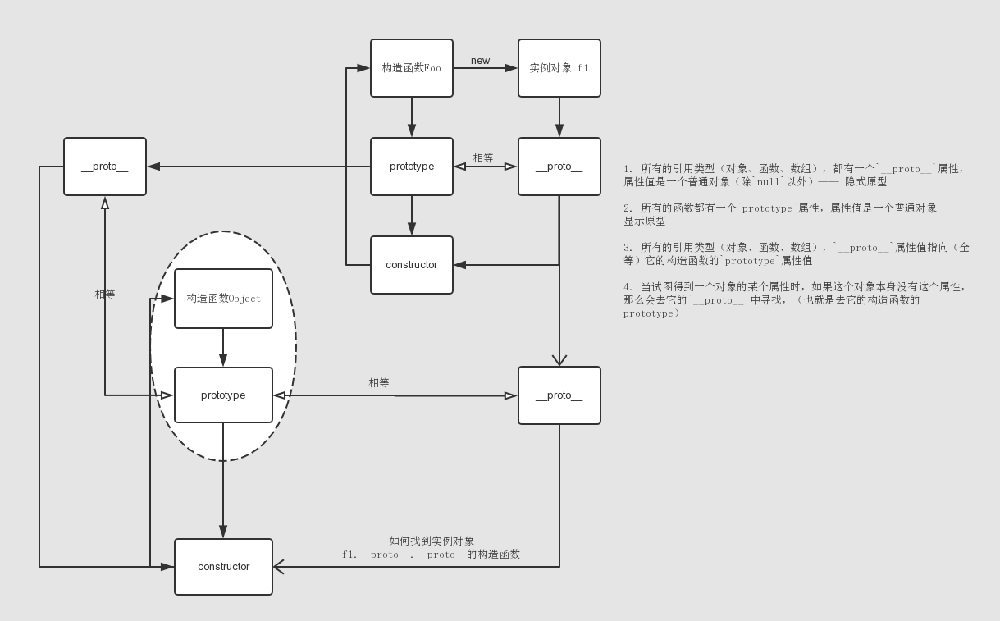

## 1. 创建对象有几种方法

```javascript
// 第一种
var o1 = {name:'o1'}
var o2 = new Object({name:'o2'})
// 第二种
var M = function(name){this.name=name}
var o3 = new M('o3')
// 第三种
var P = {name:'p'}
var o4 = Object.create(P)
```

## 2. 原型、构造函数、实例、原型链

[他们之间的关系：](https://www.processon.com/view/link/593e2ce0e4b05a4d4381a646)



### 构造函数：就是函数,名字首字母应该大写

```javascript
function Foo(name,age){
  this.name = name
  this.age = age
  this.class = 'class-1'
  // return this // 默认有这行
}
```
### 实例对象：new 函数() => 实例

```javascript
// 创建多个实例对象
var f1 = new Foo('zhangsan',21)// new 就是实例化的过程
var f2 = new Foo('lisi',22)
var f3 = new Foo('wangwu',23)
```

**`实例对象.__proto__ === 构造函数.prototype`**

#### 描述 new 一个对象的过程

1. 创建一个新对象
2. this 指向一个新对象性（空的）
3. 执行代码，即对 this 赋值（this.key = value）
4. 返回 this ，即`return this`(默认就执行了，不用写 return)


1. 创建一个新对象，它继承自`构造函数Foo.prototype`
2. 执行构造函数Foo。执行时，相应的参数会被传入，同时上下文 this，指向这个新实例。在不传递参数时，`new Foo`等同于`new Foo()`
3. 构造函数 Foo，`return`一个对象，那么这个对象会取代整个 new 出来的结果。如果构造函数没有`return`对象，那么 new 出来的结果，就是步骤1创建的新对象


### 原型对象：prototype，每个函数都有这个属性，也是用于构造函数扩展

```javascript
Foo.prototype.alertName = function(){
  alert(this.name)
}

f1.printName = function(){
  console.log(this.name)
}

f1.printName()
f1.alertName()
```

#### 构造器：constructor，

constructor是原型对象（prototype）下的属性，它的作用是指向声明的那个函数（就是构造函数）

`Foo.prototype.constructor === Foo`返回`true`

#### 原型5条规则：

1. 所有的引用类型（对象、函数、数组），都具有对象特性，即可自由扩展属性（除`null`以外）
2. 所有的引用类型（对象、函数、数组），都有一个`__proto__`属性，属性值是一个普通对象（除`null`以外）—— 隐式原型
3. 所有的函数都有一个`prototype`属性，属性值是一个普通对象 —— 显示原型
4. 所有的引用类型（对象、函数、数组），`__proto__`属性值指向（全等）它的构造函数的`prototype`属性值
5. 当试图得到一个对象的某个属性时，如果这个对象本身没有这个属性，那么会去它的`__proto__`中寻找，（也就是去它的构造函数的 prototype）

#### 原型链

```javascript
f1.toString() // 要去 f1.__proto__.__proto__中去找
```


```

## 3. instanceof 的原理

instanceof：用于判断`引用类型`属于哪个构造函数派生出来的，且只要是这条原型链上的构造函数，都会返回 ture

this 指向

循环对象自身的属性：obj.hasOwnProperty(attr)

